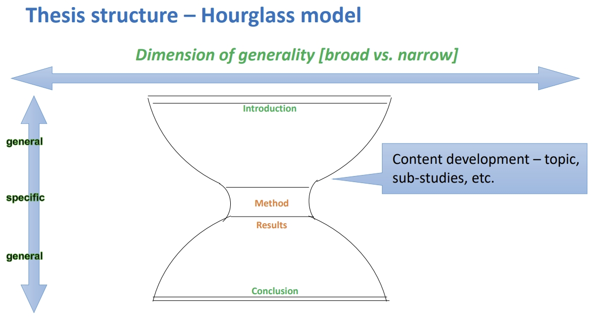

# CIVL6060 Artificial Intelligence for Maintenance (Robotics topics)

Hi, I'm Ruiqi, the teaching assistant of CIVL6060. In addition to the tutorial delivered in the class, the following is another supplementary for your essay.

The HTML version of this introduction could be found at [CIVL6060-AI4M](https://richj233.github.io/CIVL6060_AI4Maintenance-Robotics/README.html).

## Essay main body

Part of this section is referenced [Guidelines For Writing Up Your Research](https://ocw.mit.edu/courses/20-109-laboratory-fundamentals-in-biological-engineering-spring-2010/pages/assignments/guidelines-for-writing-up-your-research/#Introduction).

The suggested structure of the essay is
 (credited by Dr Tsang, GRSC6121).

### Introduction

Think comprehensively about how to tell your story to others. 
The introduction provides a framework for the story you are about to tell and thus serves two main purposes. 
For one, you must provide sufficient background information for a reader to understand the forthcoming results. 
Just as importantly, you must motivate the audience to keep reading!

Generally, the suggested motivation (this topic) could be categorized as follows:

- The labour shortage, causing increasing prices, leads to the introduction of robotics;
- Robotics/AI technologies can reduce the training period for workers;
- Risk reduction is also a popular research topic in on-site maintenance;
- Industrialized construction requires high production precision;
- Robots applied for inspecting;
- So on...

For example, to environmental inspection for building maintenance->

1. The labour shortage, causing increasing prices, leads to the acceptance of robotics,
2. Industrialized construction requires high production precision, especially for inspection.
3. So that the inspection robot can well handle the problems mentioned above and speed up the digitalization of maintenance.

### Literature review

The literature review should be fundamental to your motivations. Although this part is the second part of your essay, I suggest you do this part work at the beginning of your masterpiece. When you do not have a specific research topic, doing some review work seems a good choice.

Here are several suggested steps for your review process (for example, as the topic "Inspection with robots in maintenance work" ):
1. Search your keywords in the academic search system (e.g., Google Scholar, web of science, etc.);
2. Read the amount of suitable publications;
3. Summarizing those publications and find the differences and similarities;
4. Decide the current problem you need to handle;
5. Handle it with your tools.

For example, to environmental inspection for building maintenance->

1. The current robotic inspection works are based on UAVs; they cannot load heavy equipment and have crush risks.
2. Compared with settling inspection points, path planning-driven inspection can further improve autonomousness.

### Research methodology

- The most essential part of your research. You should introduce the technical route, explain why it can work, and provide specific validated criteria in this section.
- You may utilize descriptive sentences, figures, diagrams, or pseudocode.
- E.g., [Figure](./Figs/fig1.png), [Diagram](./Figs/fig2.gif), [Pseudocode](./Figs/fig3.png).

For example, to environmental inspection for building maintenance->

1. Firstly, introduce the structure of your proposal.
2. Mesh the map.
3. Compute which inspection point can acquire more information from movement.
4. To reach this point, the path can be calculated by the proposed algorithm.

### Results and discussion

- The purpose of the results section is to present your data in a relatively unbiased way but with some guiding framework. Begin with a short description of the goal and strategy of your experiment, and then delve into specific sub-sections that describe each piece of the work.
- To write the results section, use the figures and tables as a guide.
- Present the data as fully as possible, including stuff that does not quite make sense at first glance. Ultimately, each sub-section should begin with an overview sentence that introduces the present experiment and end with a sentence stating the primary conclusion reached from that experiment.

### Conclusions

- The purpose of the discussion section is to interpret and contextualize your research. It would help if you began by reiterating your research's purpose and major findings. Then, you can connect your findings to other research, explain where you expect your work to lead, suggest specific experiments for extending your findings, and describe any conceptual or technical limitations of the research. Finally, you should explain the significance of your findings to basic science and engineering applications. Like the previous sections, the discussion should have a clear organization and narrative flow, whether or not you use sub-sections.

### Acknowledgements

- To whom you want to thank.
- The declaration of data requirement.
- Another announcement.

### References

- The APA format is suggested.
- Plagiarism is the use of another person's work (including but not limited
to any materials, creations, ideas and data) as if one's own without due
acknowledgement, whether or not such work has been published and
regardless of the intent to deceive. (HKU Policy of Research Integrity)
- Please cite appropriately.

## Appendix

- This repository is ONLY for the course assessment (essay part) of students enrolled in CIVL6060. Please notify me if you have any other inquiries.
- If you have any inquiries, please feel free to drop an email to jiang_ruiqi AT connect DOT hku DOT hk.
